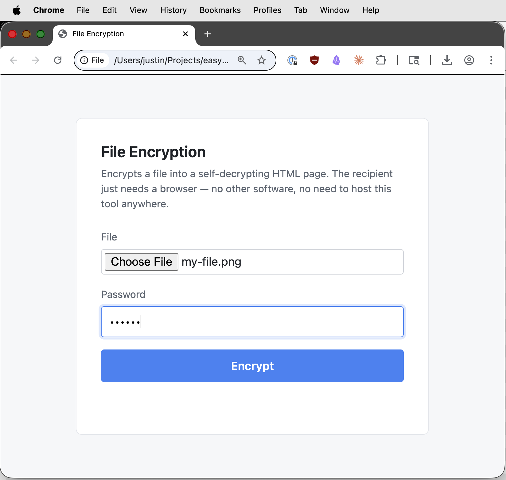
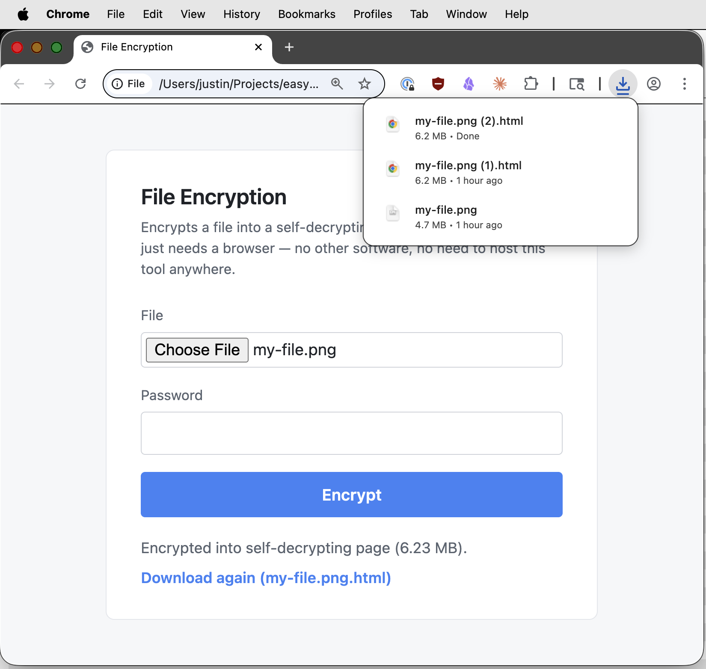
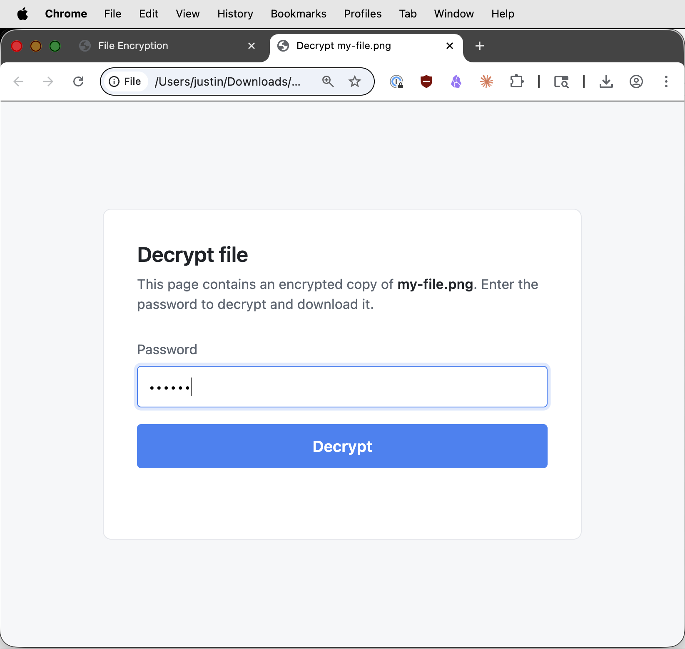
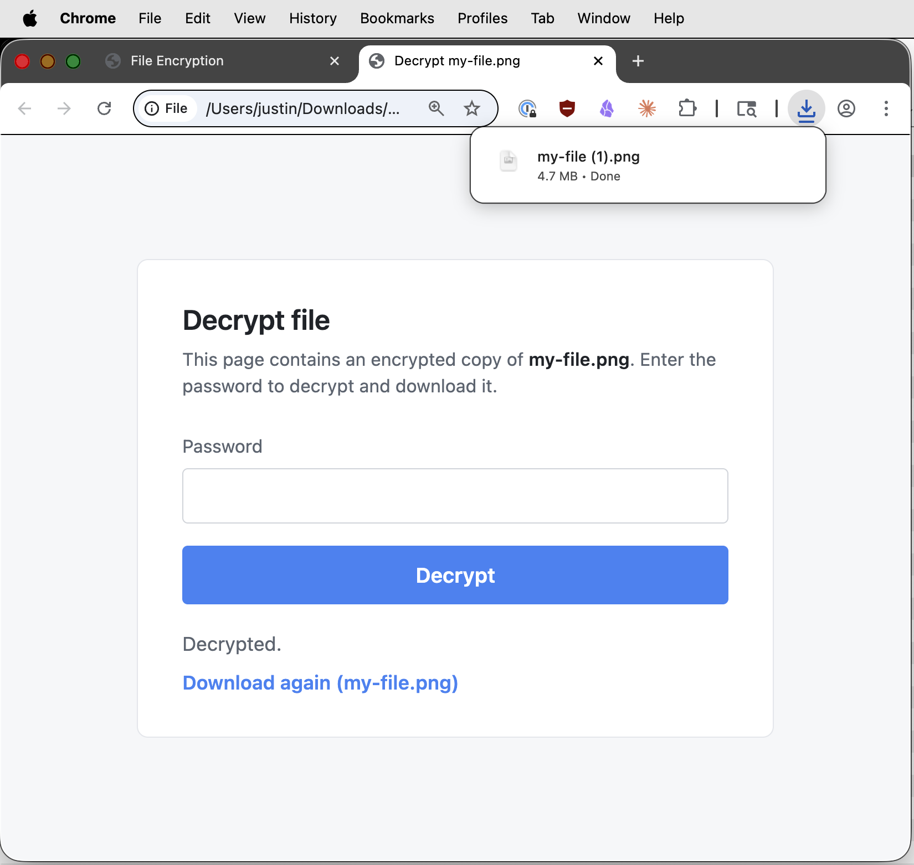

# easy-file-encryption

A single HTML file that encrypts a file in your browser and produces a **self-decrypting HTML page** as the output. The recipient just opens the page in any browser and types the password — no software to install, nothing to host, no accounts.

Crypto: AES-256-GCM with a key derived via PBKDF2-SHA256 (600,000 iterations, per OWASP guidance). Salt and IV are randomly generated per file. Everything runs client-side via the Web Crypto API.

## Usage

Open `easy-file-encryption.html` in a browser, pick a file, and enter a password.

Click **Encrypt**. The output is a single `.html` file that contains the ciphertext and a small decryption UI.

Send that `.html` file to the recipient (email, Slack, USB stick, whatever). They open it in a browser and enter the password.

Click **Decrypt** and the original file downloads.

## Limits

50 MB max input — the whole plaintext, ciphertext, and base64-encoded payload all sit in browser memory at once, and the output HTML is ~1.33× the input size.

## Caveats

The recipient is trusting whoever sent the HTML page that the embedded decryption code hasn't been tampered with. If that matters to you, diff the script against this repo's copy before running it. Browser memory may also retain decrypted bytes until the tab is closed.
