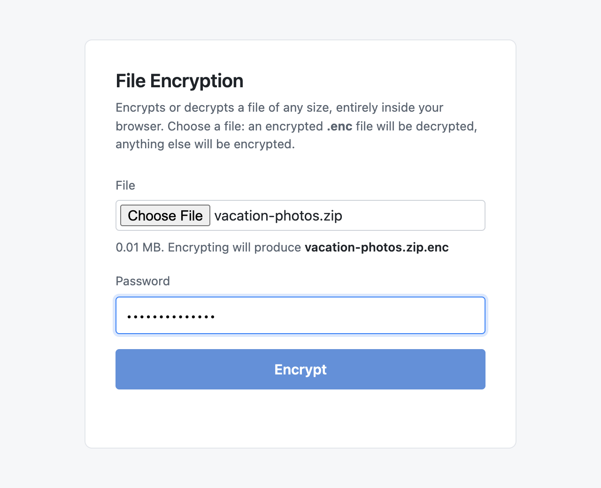
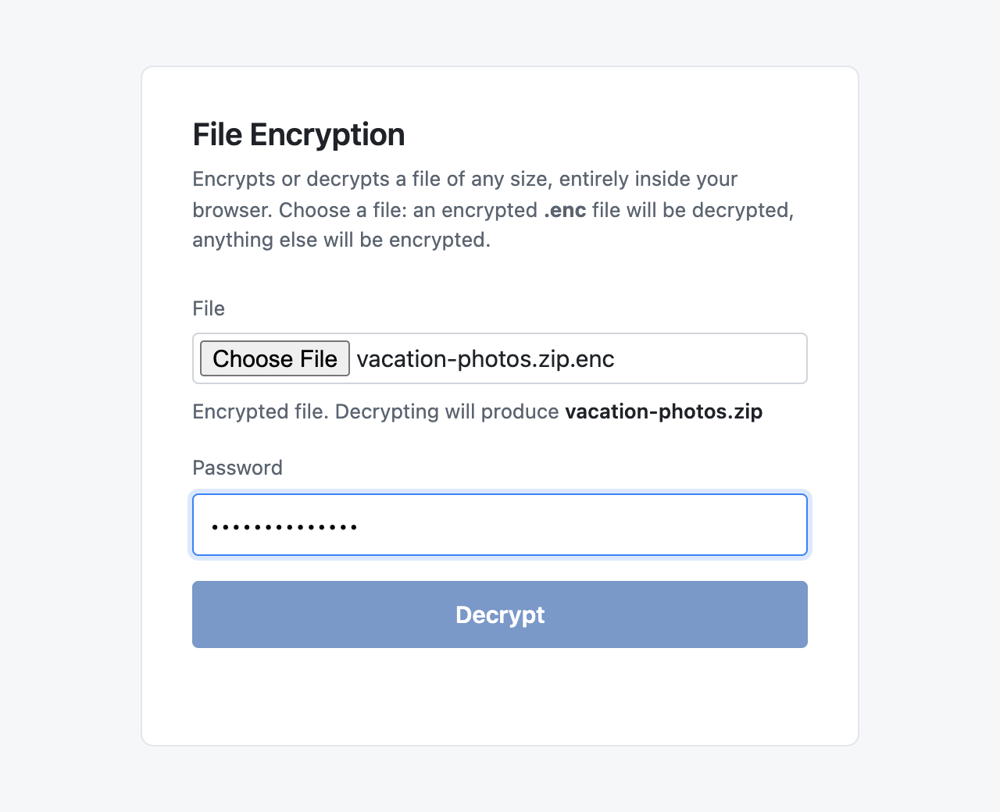

# easy-file-encryption

A single HTML file that encrypts or decrypts a file in your browser. Send the encrypted `.enc` file and this page to the recipient; they open the page in any desktop browser, pick the `.enc` file, type the password, and get the original file back. No software to install, nothing to host, no accounts.

Crypto: AES-256-GCM with a key derived via PBKDF2-SHA256 (600,000 iterations, per OWASP guidance). Salt and nonce prefix are randomly generated per file. The file is processed in 8 MiB chunks, each authenticated with its index, so there is no practical size limit and any truncation, reordering or edit of the ciphertext is detected. Everything runs client-side via the Web Crypto API.

## Usage

Open `easy-file-encryption.html` in a browser, or use the hosted copy at **https://justinpearson.github.io/easy-file-encryption/**, and pick a file. Either way the file is read and written on your own computer: the page makes no network requests after it loads, and a Content-Security-Policy in the page forbids the browser from sending anything anywhere. The button reads **Encrypt** for an ordinary file and **Decrypt** for a `.enc` file the tool produced.



Enter a password and click. On Chrome and Edge a Save dialog appears and the output streams straight to disk. On Firefox and Safari the output is assembled in memory and downloaded.

Send the `.enc` file plus a copy of `easy-file-encryption.html` to the recipient, and tell them the password some other way. They open the page, pick the `.enc` file, and enter the password.



## Size limits

Encryption and decryption read and write one 8 MiB chunk at a time, so the browser's memory use stays small regardless of file size. Where the output goes does depend on the browser:

- **Chrome and Edge** stream the output to a file through the Save dialog. A 900 MB file round-trips in about 15 seconds each way and never sits in memory.
- **Firefox and Safari** have no streaming save, so the output is collected as a Blob and handed to a download link. In testing with Playwright's Firefox 156 and WebKit 26.6 builds, files of 300, 600 and 900 MB all round-tripped in a few seconds. (The same download-link path in headless Chrome for Testing fails above 300 MB, but real Chrome takes the streaming path, so that does not affect normal use.) Files of several GB are still better handled in Chrome or Edge, where nothing is held in memory.

Mobile browsers are not supported: the download step fails on iOS Safari.

## Caveats

The recipient is trusting whoever sent the HTML page, or whoever controls this repository if they use the hosted copy, that the decryption code hasn't been tampered with. If that matters to you, diff the page against this repo's copy before running it. The Content-Security-Policy makes any network send fail loudly, but a tampered page could remove that tag, so it guards against mistakes rather than a hostile maintainer.

Email providers may block or strip `.html` and `.enc` attachments. Send them via a link-share service, a chat app, or a USB stick instead.

Files produced by the previous version of this tool (self-decrypting `.html` pages, format `ENC1`) still decrypt on their own; this version does not read them.

## Command line

The same crypto core runs outside the browser, so archives made by script open in the page and the other way round. Both tools need only Node 20 or newer.

`tools/efe-cli.mjs` encrypts or decrypts one file:

```
node tools/efe-cli.mjs encrypt photos.zip photos.zip.enc
node tools/efe-cli.mjs decrypt photos.zip.enc photos.zip
```

It prompts for the password without echo, or reads it from the first line of stdin with `--password-stdin`. Output is written to a `.part` file and renamed into place only on success, and an existing output is never overwritten without `--force`.

`tools/encrypt-folders.zsh SRC OUT` zips each immediate subfolder of `SRC` into `OUT/<name>.zip.enc`, all under one password. Every step is checked: the zip is tested and each file inside it is hashed against the source, then the `.enc` is decrypted again and byte-compared with the zip before the plaintext zip is deleted (`--keep-zips` keeps it). Nothing is ever written inside `SRC`. Folders whose `.enc` already exists are skipped unless `--force` is given, so an interrupted run can be resumed. `OUT/MANIFEST.txt` lists every archive with its size and SHA-256. `--password-file FILE` reads the password from a file for unattended runs.

## Tests

The crypto core has no DOM dependencies and runs under Node's built-in WebCrypto, so the unit tests need nothing installed:

```
node --test tests/core.test.mjs
```

`tests/cli.test.mjs` covers the command-line tool the same way. `tests/e2e.mjs` drives the page in a real browser and round-trips a file of any size. It needs a Playwright install somewhere on disk; see the header comment in that file.
